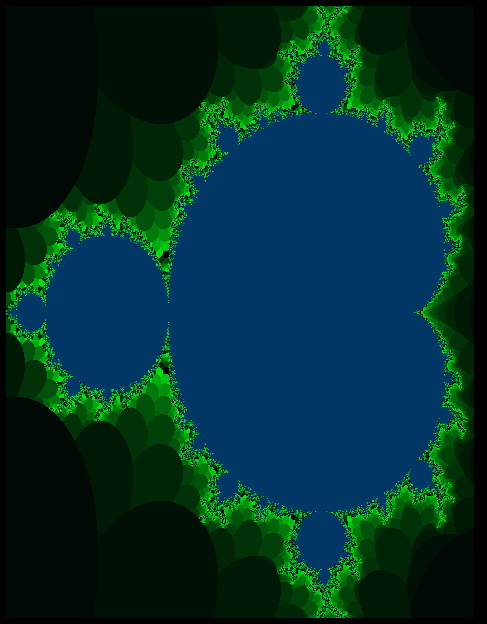

# Quick Start
No dependencies / No cargo. Be creative and try your own colourings! <br />
Changing the picture dimensions can create really interesting patterns. <br />
Create your own mandelbrot set image (```.ppm``` format) with:
```bash
$ sh build.sh
```

